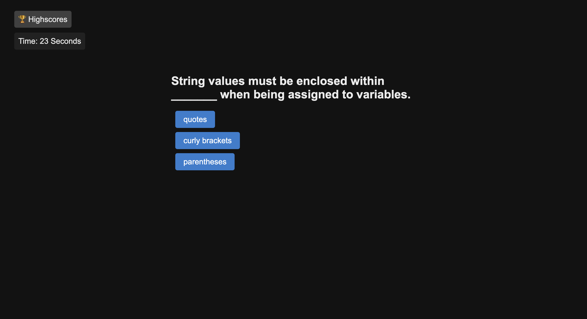

# How much do you know about JavaScript?

This application is a quiz game that tests your knowledge of JavaScript. You have 30 seconds to answer all of the questions.

## Description

- When clicking start, a countdown timer begins and the first question is displayed.
- When a question is answered, the user is notified if they were correct or incorrect.
- If the user is incorrect, 5 seconds are deducted from the timer.
- When a question is answered, the next question is displayed.
- The game is over when all questions are answered or the timer reaches 0.
- When the game is over, the user can save their initials and score.
- The user can view the highscores at any time.

## Usage

The deployed quiz site can be found [here](https://annabrisland.github.io/test-your-knowledge).

## License

[MIT](https://choosealicense.com/licenses/mit/)